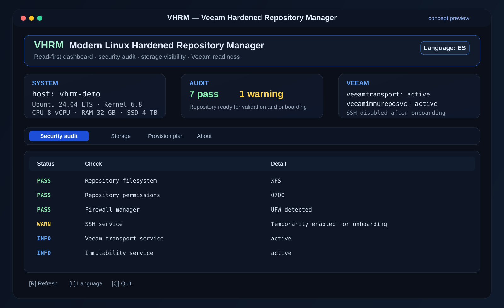

<p align="center">
  <a href="README.md">🇺🇸 English</a> ·
  <a href="README.es.md">🇪🇸 Español</a> ·
  <a href="README.pt-BR.md">🇧🇷 Português</a> ·
  <a href="README.zh-CN.md">🇨🇳 中文</a>
</p>

<h1 align="center">VHRM — Veeam Hardened Repository Manager</h1>

<p align="center">
  <strong>Modern open-source TUI for auditing and preparing Linux hosts used as Veeam Hardened Repositories.</strong>
</p>

<p align="center">
  
  
  
  
  
</p>

<p align="center">
  
</p>

<p align="center"><em>Concept preview of the VHRM execution interface.</em></p>

<p align="center">
  
</p>

## Overview

VHRM is a community project that modernizes the idea behind [`tdewin/veeamhubrepo`](https://github.com/tdewin/veeamhubrepo) with a cleaner architecture, a modern Textual-based interface, multilingual support and a **read-first** operating model.

Instead of immediately executing high-risk actions, VHRM focuses on:

- visibility;
- repository readiness auditing;
- Linux hardening validation;
- storage discovery;
- reviewable provisioning plans.

## Why VHRM is different

| Area | veeamhubrepo | VHRM |
|---|---|---|
| Interface | Classic dialog wizard | Modern Textual TUI dashboard |
| UX | Linear menu flow | Dashboard + tabs + live summary |
| Language support | Single language | English, Español, Português, 中文 |
| Safety model | Setup-oriented | Read-first + reviewable plans |
| Architecture | Monolithic script | Modular UI / system / planning / i18n |
| Readiness checks | Basic setup flow | XFS, permissions, firewall, SSH, services |
| Maintainability | 2021-era dependency model | Modern Python packaging (`pyproject.toml`) |

## Main features

- Modern keyboard-driven terminal dashboard.
- Built-in language selector.
- Persistent language preference stored in `~/.config/vhrm/config.json`.
- Linux distribution, kernel, CPU, RAM and root filesystem summary.
- Block-device inventory through `lsblk`.
- Security/readiness audit for:
  - supported Ubuntu target awareness;
  - firewall manager presence;
  - SSH service state;
  - Veeam transport and immutability service state;
  - repository directory presence;
  - `0700` repository permissions;
  - XFS filesystem detection.
- Reviewable repository provisioning plan generator.
- No automatic formatting of disks in the current technical-preview phase.

## Screenshot / execution preview

The preview above illustrates the intended runtime experience:

- clean dark interface;
- cards for **SYSTEM**, **AUDIT** and **VEEAM** state;
- tabbed navigation;
- keyboard-driven usage;
- quick language selector;
- visible security warnings and readiness status.

## Install

```bash
sudo apt update
sudo apt install -y python3 python3-venv python3-pip xfsprogs
python3 -m venv .venv
source .venv/bin/activate
pip install .
vhrm
```

## Internationalization

Current languages supported by the application:

- English
- Español
- Português (Brasil)
- 中文（简体）

The selected language is stored in:

```bash
~/.config/vhrm/config.json
```

## Recommended operating model

VHRM does **not** replace the official Veeam documentation or the Veeam Infrastructure Appliance. For manually configured Linux repositories, validate the host against the current Veeam Backup & Replication requirements before production use.

For a hardened repository, use dedicated block storage and prefer XFS where Fast Clone is required. Repository ownership and permissions, single-use credentials, firewall policy, SSH lifecycle and Veeam services should be reviewed as part of change control.

## Project status

> **Technical preview:** current releases are focused on auditing, UI foundation and safe planning. Destructive storage actions are intentionally not executed automatically in this phase.

## Roadmap

- [ ] Guided repository provisioning with explicit double confirmation.
- [ ] Device fingerprinting by serial / WWN.
- [ ] XFS + reflink validation.
- [ ] UFW / firewalld policy inspector.
- [ ] SSH exposure timer and onboarding lockdown helper.
- [ ] Veeam component and port diagnostics.
- [ ] Repository capacity and inode trends.
- [ ] JSON audit export for RMM / SIEM.
- [ ] `.deb` packaging.
- [ ] GitHub Actions release workflow.
- [ ] Real screenshots captured from production-like lab execution.

## Attribution

The original concept inspiration comes from:

- **veeamhubrepo** by Thomas De Win (`tdewin`) — https://github.com/tdewin/veeamhubrepo

VHRM is an **independent reimplementation** and does not copy the original Python codebase.

## Disclaimer

**Veeam® is a trademark of Veeam Software Group GmbH. This is a community project and is NOT affiliated with, sponsored by, or endorsed by Veeam Software.**

**Disk formatting, filesystem creation, firewall changes, SSH exposure and privilege changes can cause data loss or loss of access. Validate every change in a lab before using it in production.**

## License

MIT. See [LICENSE](LICENSE).
